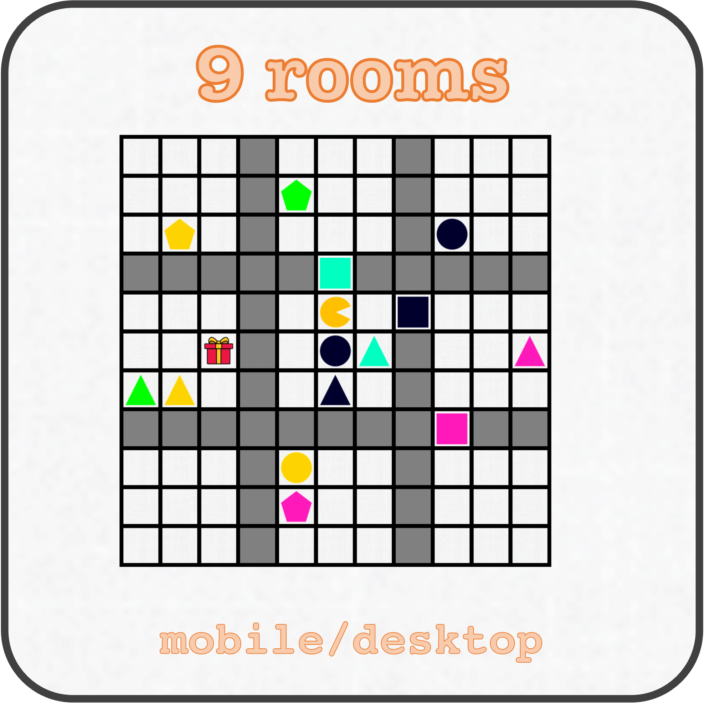

#### 
 <a href="/index">about</a> &nbsp;&nbsp;&nbsp;&nbsp; <a href="/research">research</a> &nbsp;&nbsp;&nbsp;&nbsp; <a href="/thesis/">thesis</a> &nbsp;&nbsp;&nbsp;&nbsp; <a href="/effugium">demo</a> 

 

## Game Demo

My research uses games to study how humans learn and make decisions. To play a demo of an escape room inspired game I built for this, follow the links below:

 

  
 
 

  
 
  
 

  

 
