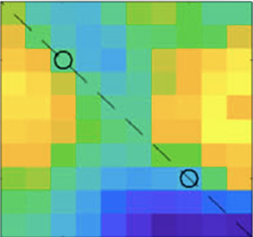
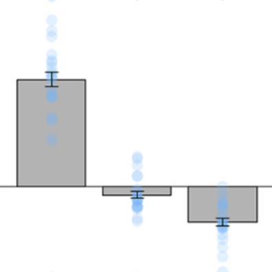
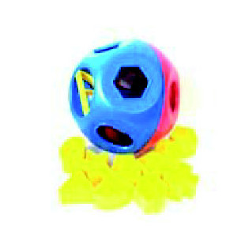

#### 
 <a href="/index">about</a> &nbsp;&nbsp;&nbsp;&nbsp; <a href="/research">research</a> &nbsp;&nbsp;&nbsp;&nbsp; <a href="/thesis/">thesis</a> &nbsp;&nbsp;&nbsp;&nbsp; <a href="/effugium/">demo</a> 

 

## Research 

My current work centers on the factors that allow us to learn about the world quickly and successfully. As part of this work, I carry out experiments in gamified environments and develop models of how we learn. To play a demo of an escape room maze game I built for this work, click <a href="https://atomsrivet.github.io/effugium/">here</a>.
 
 

### Doctoral work

 In my doctoral thesis, I investigated why seemingly irrelevant contextual information can sway what we choose when faced with perceptual and economic decisions. My research showed that a relative mode of information processing, grounded in neural normalization, can explain the rich map of contextual influence of economic decoys, perceptual distractors and temporal reference frames. By encoding information in this relative fashion, the brain can boost computational efficiency. An online version of my thesis on Context Dependencies in Decision Making is avilable <a href="https://atomsrivet.github.io/thesis/">here</a>.	

  

  

 
  
 <b>A map of decoy influence in human multialternative choice</b>, PNAS 2020  
  	<small> <i>with Vickie Li*, Konstantinos Tsetsos, and Christopher Summerfield </i>  </small> 
  	
 <small>
  	Choices between two goods can be swayed by a third, less appealing "decoy" option. Here, we mapped how diecoys with different attributes affect human decisions. We used these data to arbitrate between different extant models of contextual influence. We showed that the rich pattern of decoy influence can be captured by a theory of relative information-processing, grounded in neural normalization. We further compared different formulations of this theory using a large, flexible, nested model of neural normalization. This new model allowed us to distill the features of relative processing that drive the observed decoy effects. * This work was co-led by Dr Vickie Li who designed, built and conducted the experiment with human volunteers. </small> <a href="https://www.pnas.org/doi/full/10.1073/pnas.2005058117">pdf</a> &nbsp; <a href="https://osf.io/u6br3/">data & code</a> 

  

 

  

 
  
 <b>How do (perceptual) distracters distract?</b>, PLOS Computational Biology 2022  
  	<small><i> with  Katarzyna Rudzka, Hannah E. Smithson, Christopher Summerfield</i> </small>
  	
 <small>
  	When we make a perceptual decision about a target stimulus in the presence of other, irrelevant stimuli (distracters), our choices are less accurate. Past research has explained this effect as the result of a "competition" between targets and distracters for our attention. In this article, we showed that this classical story cannot account in full for perceptual distraction. Instead, across three experiments, we found that distracters exert an interactive influence on perceptual choices: accurate decisions are facilitated when targets and distracters are more similar. This distracter effect naturally falls out of a theory that the brain encodes information in a relative fashion. </small>  <a href="https://journals.plos.org/ploscompbiol/article?id=10.1371/journal.pcbi.1010609">pdf</a> &nbsp; <a href="https://osf.io/54rf2/">data & code</a> 

  

### Other research 

  

  
  
 <b>Green nudges: applying behavioural economics to the fight against climate change</b>, PsyPAG 2020
  	<small><i>with Mirela Zaneva </i> </small>
  	
 <small>
  	In this commentary, we review different approaches to "nudging" consumer behaviors towards greener choices. We propose a framework to maximize the potential positive impact of green nudges. </small> <a href="/assets/green.pdf">pdf</a>

  

  

  
  
 <b>Automaticity in Stimulus-Parity Synaesthesia</b>, i-Perception 2017  
  	<small><i>with Rebekah C. White, Mihaela D. Duta, and Kate Nation </i> </small>
  	
 <small>
  	Stimulus-parity synaesthetes experience many non-numeric stimuli (including shapes and colors) as odd or even. Here, we assess whether those associations are automatic through a speeded reaction time task, inspired by a colored shape sorter toy. We found that a synaesthetic participant had trouble sorting "odd" shapes into "even" colored slots, as evidenced by her slower reaction times. Our control participants did not exhibit this parity-congruence effect. </small> <a href="https://journals.sagepub.com/doi/full/10.1177/2041669517736323">pdf</a>

  

### Collaborations

 <b> Cognitive Neuroscience </b> 

 <b>Neural knowledge assembly in humans and deep networks</b>, Under review  
 <small>Stephanie Nelli, Lukas Braun, <b>Tsvetomira Dumbalska</b>, Andrew Saxe, Christopher Summerfield</small> <a href="https://www.biorxiv.org/content/10.1101/2021.10.21.465374.full.pdf">pdf</a>

 <b>Orthogonal representations for robust context-dependent task performance in brains and neural networks</b>, Neuron 2022  
 <small>Timo Flesch, Keno Juechems, <b>Tsvetomira Dumbalska</b>, Andrew Saxe, Christopher Summerfield</small> <a href="https://www.sciencedirect.com/science/article/pii/S0896627322000058">pdf</a>

 <b>How does value distract?</b>, Nature Human Behaviour 2022  
 <small>Christopher Summerfield, <b>Tsvetomira Dumbalska</b> </small> <a href="/assets/value.pdf">pdf</a>

 <b>“17” is odd and “seventeen” is even: Meaning and physical form in stimulus-parity synaesthesia</b>, Quarterly Journal of Experimental Psychology 2018  
 <small>Rebekah C White, <b>Tsvetomira Dumbalska</b>, Mihaela D Duta, Kate Nation</small> <a href="/assets/17.pdf">pdf</a>

 <b>Two left hands, ten interlaced fingers: a new rubber hand illusion</b>, Perception 2016   
 <small>Rebekah C White, Dillon Bowen, <b>Tsvetomira Dumbalska</b>, Katharine Hoeger, Anastasia YS Mok</small> <a href="/assets/hands.pdf">pdf</a>

 <b> Open Science </b> 

 <b>A network of change: united action on research integrity</b>, BMC Research Notes 2022  
 <small>Thomas Rhys Evans, Madeleine Pownall, Elizabeth Collins, Emma L Henderson, Jade S Pickering, Aoife O’Mahony, Mirela Zaneva, Matt Jaquiery, <b>Tsvetomira Dumbalska</b></small> <a href="https://bmcresnotes.biomedcentral.com/articles/10.1186/s13104-022-06026-y">pdf</a>

 <b>A community-sourced glossary of open scholarship terms</b>, Nature Human Behaviour 2022  
 <small>Sam Parsons, Flávio Azevedo, Mahmoud M Elsherif, Samuel Guay, Owen N Shahim, Gisela H Govaart, et al.</small> <a href="https://www.nature.com/articles/s41562-021-01269-4">pdf</a>

